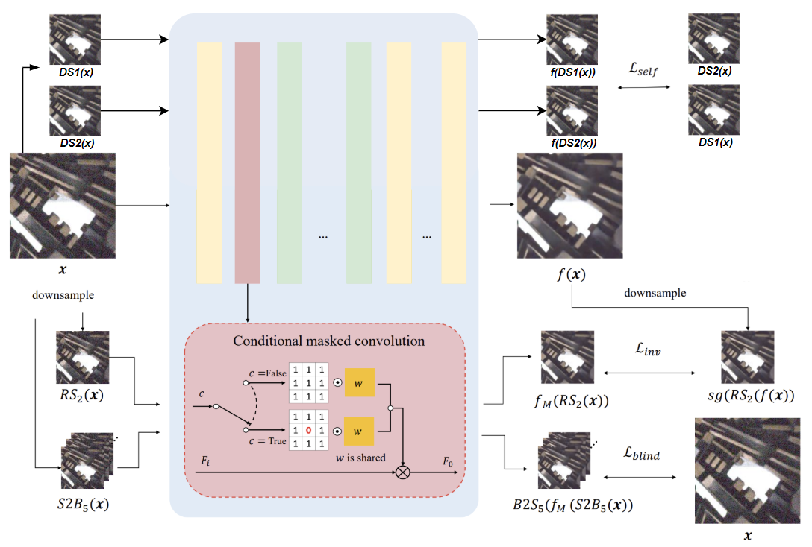

# NYCU_IP_FinalProject_Vision-in-Pixels

### Model
#### Modify C-BSN


The following part is the original C-BSN architecture. Our adjustment, shown above, incorporates zero-shot Noise2Noise pairs down-sampling into the pipeline and calculates a new loss.


### Environment

-	Ubuntu 18.04
-	Tensorflow 1.15
-	Python 3.7

```
conda env create -f environment.yaml
conda activate tf1
```


### Dataset

- Place noisy datasets in dataset folder.
  - [[SIDD-Medium Dataset/Validation Data and Ground Truth]](https://www.eecs.yorku.ca/~kamel/sidd/)

- Final dataset directories should be like 
```
dataset
├─ SIDD_Medium_Srgb
│  └─....
├─ ValidationNoisyBlocksSrgb.mat
└─ ValidationGTBlocksSrgb.mat
```

- Run prepare_dataset.py to make tfrecords and validation npy .

[comment]: <> (- you can use custom images as training dataset by glob command for dataset argument)

### Training code
```
python train.py --gpu [GPU_ID] --name [Experiment Name]

Arguments
    --gpu       GPU ID
    --name      Name of Experiment. Checkpoints and tfevents will be saved in ckpts/[name].
    --dataset   Training dataset(tfrecords) : SIDD
    --patchsize Size of training patch. Must be dividable by stride_b and stride_i. (default: 120)
                Use 240 for better performance.
```


More details about optional arguments can be found with 
```
python train.py --help 
```


### Test code

```
python infer.py --gpu [GPU_ID] --modelpath [Checkpoint_path] --imagepath [Image_glob] --savepath [Output folder]
```

You can use the following sample command to test the denoiser with sample images.

```
python infer.py --gpu 0 --modelpath ./pretrained/CBSN_SIDDtrain.ckpt --imagepath ./Figures/sampleimage*.png --savepath ./results/
```